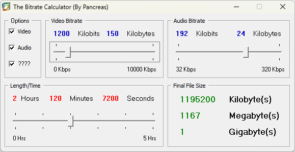
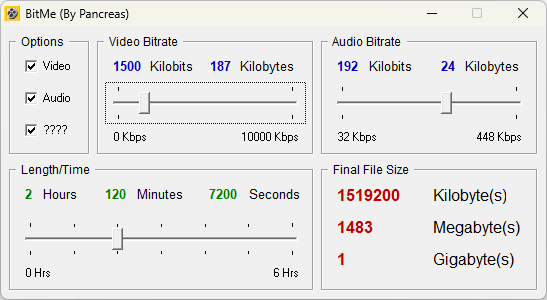
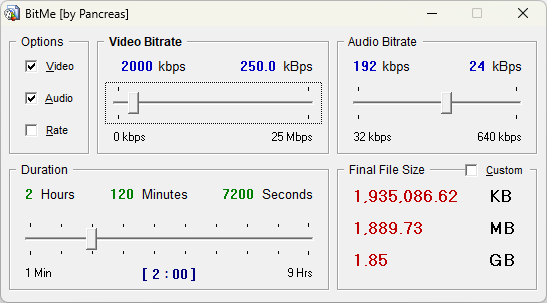

This repository holds the source code of the original BitMe written in Visual Basic 4, from 2004 to 2007. It is for my own nostalgic records, but one can take a look and compare it to the [current C++ version](https://github.com/GeoffreyAA/bitme). In October 2026, I fixed the projects without changing the code: some form paths were hard coded; unneeded controls were referenced; and the last version had an issue with the FRX file for the About form. For each milestone, I compiled a native-code executable in Visual Basic 6 SP6, on Windows 11, which worked, surprisingly, and made a set of releases. All run on Windows 11 and XP, and I expect the versions in between. Of course, these are for the sake of interest and archival, and anyone who deems the program useful is advised to use the [present version](https://github.com/GeoffreyAA/bitme/releases).

